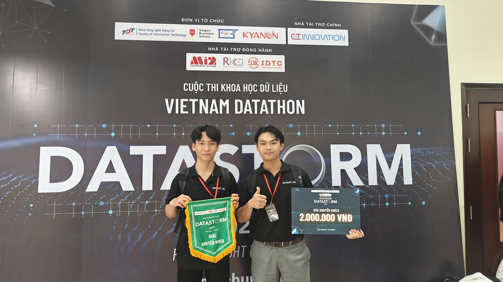
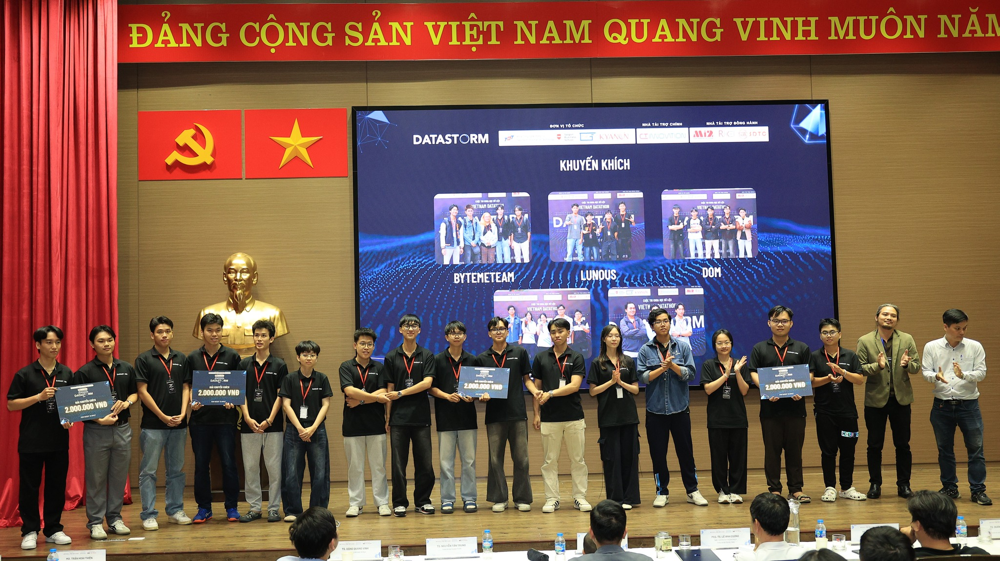
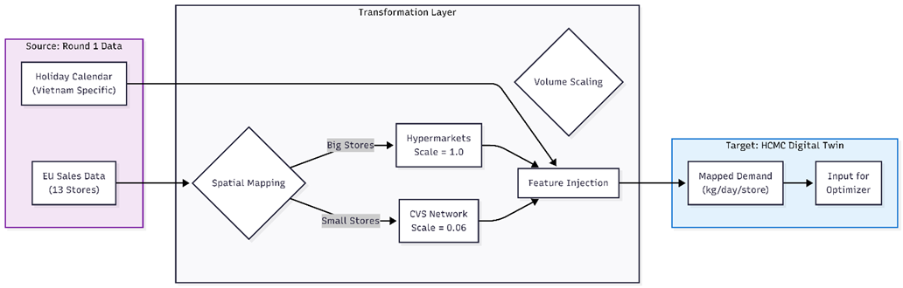
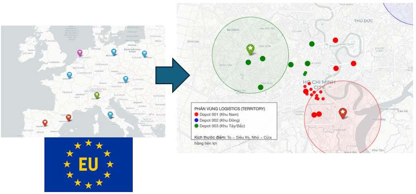
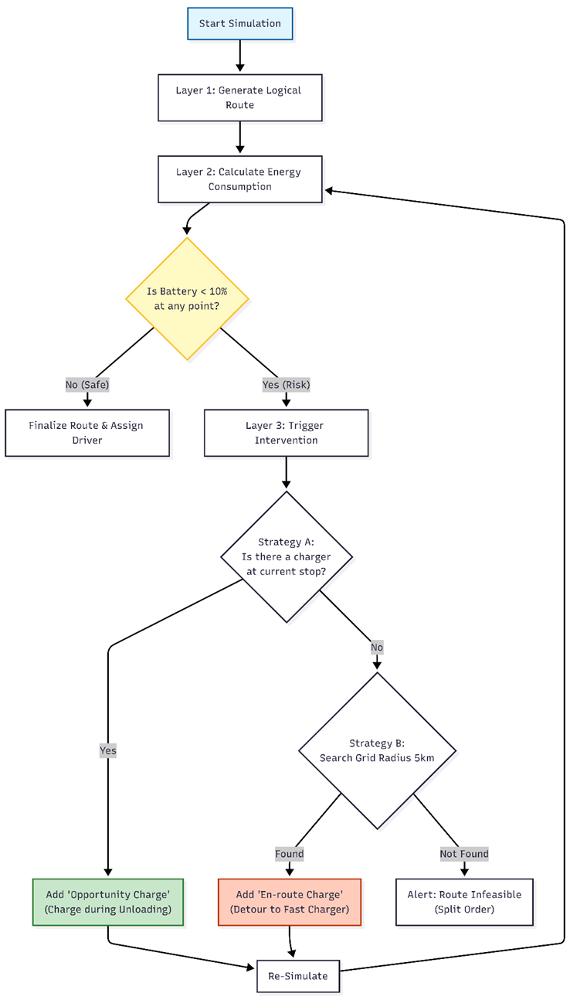
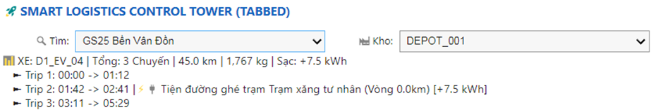
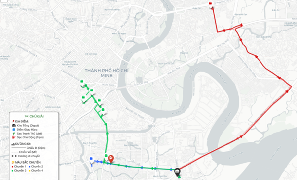
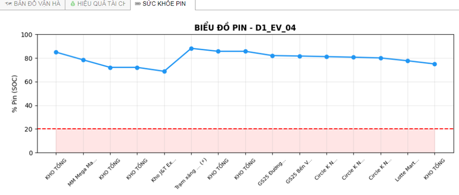
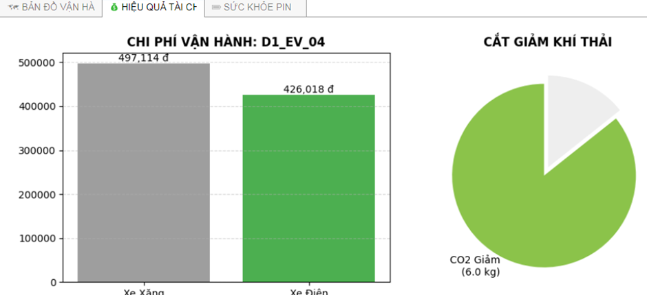

# Green-Logistics Optimizer

AI-powered EV route optimization for urban FMCG delivery in Ho Chi Minh City.

**YouTube Demo:** https://youtu.be/zgvR39K6_rE

**Achievement:** Consolation Prize (Khuyen khich), Vietnam Datathon 2025 - DataStorm.

## Project Story

This project was built to challenge a common assumption in logistics: _green operations are expensive_.  
Our team designed an end-to-end decision system that combines demand forecasting, geospatial infrastructure modeling, and EV routing optimization. The outcome shows that sustainability and profitability can move together when decisions are data-driven.

### Award Evidence

- Official post: https://www.facebook.com/share/p/1PfdwTtG6q/

| Receiving Award - Photo 1                               | Receiving Award - Photo 2                                 |
| ------------------------------------------------------- | --------------------------------------------------------- |
|  |  |

## Why This Project Matters

- Vietnam has made strong climate commitments (Net Zero direction by 2050).
- Last-mile FMCG logistics in HCMC faces congestion, demand volatility, and high operational pressure.
- EV fleets require charging-aware planning, not just classic distance minimization.

This repository implements a practical "Control Tower" workflow for that challenge.

## Solution Architecture

The final solution is organized into 3 integrated modules.

_Architecture view: transformation from Round 1 EU demand signals into HCMC digital-twin inputs for optimization._

### 1) Demand Sensing (FMCG)

- Processes raw FMCG sales into localized HCMC demand.
- Maps original stores to HCMC retail topology.
- Trains a Random Forest demand model with holiday/weekend/promotion-aware features.

### 2) Infrastructure Digital Twin

- Builds a realistic charging ecosystem for HCMC using EV charging and OSM-based data.
- Creates depot-store-station geospatial assets used by the optimizer.

_Digital twin view: mapped stores, depot territories, and network structure for routing._

### 3) Green Decision Engine

- Solves constrained routing with Google OR-Tools.
- Adds battery/energy feasibility checks.
- Inserts charging interventions when trips are not energy-safe.
- Exports final operation plans and interactive visual outputs.

| Decision Engine Logic                                  |
| ------------------------------------------------------ |
|  |

_Operational logic: route generation, battery risk check, and charging intervention strategies._

## Competition Results

Based on the project report (`RP_DataStorm_round_2.docx`):

- **38% fleet-size reduction** via dynamic multi-trip scheduling.
- **11.9% daily OPEX savings** when combining EV economics and route optimization.
- Stable operations under heavy constraints (payload, congestion, holiday surge).

From repository output artifacts:

- `optimized_routes_final.json` contains **47 optimized trips**.
- Total planned distance in exported schedule: **683.76 km**.

### Product Snapshots

**Control Tower UI**

**Route Simulation Map**

| Battery Health                             | Cost & Emission Panel                             |
| ------------------------------------------ | ------------------------------------------------- |
|  |  |

## Notebook Walkthrough

### Module A - FMCG Demand Pipeline

- `notebooks/FMCG_Sale_DATA/01_Raw_EU_FMCG_EDA.ipynb`
- `notebooks/FMCG_Sale_DATA/02_EU_Store_to_HCM_VN_Store_Processing.ipynb`
- `notebooks/FMCG_Sale_DATA/03_FMCG_Random_Forest_Model.ipynb`
- `notebooks/FMCG_Sale_DATA/04_HCM_STORE_EDA.ipynb`

### Module B - EV Infrastructure Pipeline

- `notebooks/EV_Charging_Stations_DATA/01_EV_Charging_Stations_EDA.ipynb`
- `notebooks/EV_Charging_Stations_DATA/02_HCM_EV_Charnging_Stations_Crawling.ipynb`
- `notebooks/Stores_and_Depots_HCM_Located_DATA/HCM_Map.ipynb`

### Module C - Optimization + Control Tower

- `notebooks/01_Route_Optimization.ipynb`
- `notebooks/02_Demo_Dashboard.ipynb`
- `REPORT_CHART.ipynb`

## Data and Outputs

### Processed data (`data/02_processed`)

- `demand_forecast_hcm.csv`
- `demand_forecast_hcm_updated.csv`
- `depots.csv`
- `hcm_real_ev_stations.csv`
- `stores_hcm_real.csv`

### Final outputs (`data/03_output`)

- `optimized_routes_final.json`
- `visualization_map.html`
- `hcm_real_stations.html`

### Raw data download

- Google Drive folder: https://drive.google.com/drive/folders/1oteX3fA6EAeXzRPInSOMG__pXt0SI9Y9?usp=sharing
- Files to download:
  - `ev_stations.csv`
  - `fmcg_sales.csv`

## Suggested Extra Images for GitHub

To make the repository more compelling for recruiters and judges, add these visuals into `github-assets/` and embed them here:

- `kpi_scorecard.png`: business KPI card (fleet reduction, OPEX saving, service level, CO2 estimate).
- `route_before_after.png`: comparison map before vs after optimization.
- `battery_profile.png`: one vehicle trip battery trajectory with charging intervention points.
- `model_feature_importance.png`: Random Forest feature importance chart.
- `depot_zoning_map.png`: depot coverage and store zoning map.

## How to Reproduce

1. Run FMCG notebooks to generate demand files in `data/02_processed`.
2. Run EV infrastructure notebooks to generate charging/station assets.
3. Run `notebooks/01_Route_Optimization.ipynb` to produce `optimized_routes_final.json`.
4. Run `notebooks/02_Demo_Dashboard.ipynb` to generate interactive visualization outputs.

## Data Governance Notice

This repository follows the competition dataset constraints in `asign.txt`:

- Raw competition data is proprietary to the Vietnam Datathon DataStorm organizers.
- This public repository keeps reproducible code and processed artifacts, while excluding raw source data from version control.

## Tech Stack

- Python, Jupyter Notebook
- pandas, numpy, scikit-learn
- OR-Tools (vehicle routing)
- folium, osmnx, matplotlib, seaborn
- ipywidgets, requests

## Team

**Team ID:** Chu beo  
Vietnam Datathon 2025 - DataStorm

---

If you are a recruiter, mentor, or collaborator interested in green logistics and applied optimization in Vietnam, feel free to connect.
